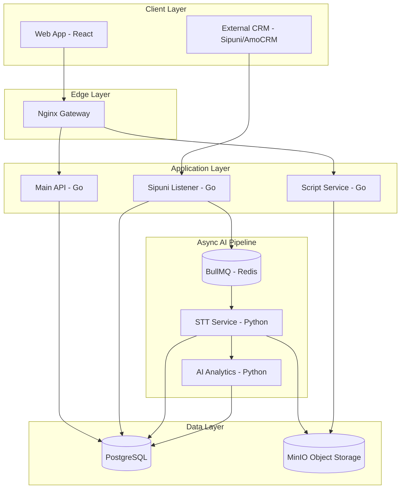
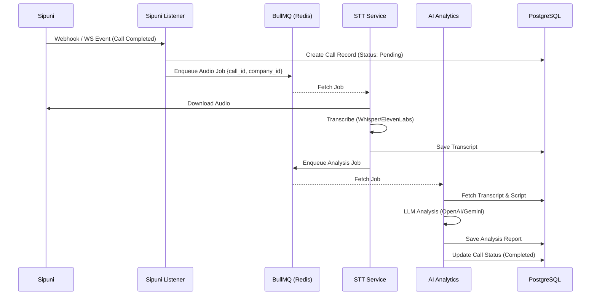

# SalesAI - System Architecture Overview

**Version:** 2.0 (Multi-Tenant Refactor)
**Status:** Architecture Design Document

---

## 1. Executive Summary

SalesAI is a multi-tenant SaaS platform designed for automated sales call quality assurance and AI-driven coaching. The system transitions from a single-company model to a scalable, multi-tenant architecture where **Tenant (Company)** is a first-class citizen.

The architecture follows **Clean Architecture** principles across all services, utilizing a polyglot microservices approach (Go/Python) to balance performance and AI capabilities.

---

## 2. High-Level System Architecture

The system is composed of several specialized microservices communicating via gRPC, HTTP, and event-driven message queues (BullMQ/Redis).

---

## 3. Multi-Tenancy Model

### 3.1 Tenant Isolation Strategy
SalesAI uses a **Shared Database, Shared Schema** approach with **Row-Level Isolation** for structural clarity while maintaining operational efficiency.

- **Request Isolation**: Every request is authenticated via JWT containing a `tenant_id` (company_id).
- **Data Isolation**: All database tables include a `company_id` column. Middleware enforces this context at the repository layer.
- **Storage Isolation**: Files in MinIO are prefixed by `tenant_id` (e.g., `s3://bucket/{tenant_id}/audio/{call_id}.mp3`).
- **Config Isolation**: Provider keys and STT/LLM preferences are stored per-tenant in the `auth_schema.companies` table.

### 3.2 Service Boundaries

| Service | Language | Role | Multi-tenant Context |
| :--- | :--- | :--- | :--- |
| **Main API** | Go | Orchestrator & Gateway | Resolves `tenant_id` from JWT; Filters all CRUD. |
| **Sipuni Listener** | Go | Ingestion | Resolves `tenant_id` from API Key/Webhook metadata. |
| **STT Service** | Python | Transcription | Processes jobs with explicit `company_id` from queue. |
| **AI Analytics** | Python | Intelligence | Evaluates calls using tenant-specific scripts and models. |

---

## 4. Call Processing Pipeline

The sequence below illustrates the lifecycle of a call from ingestion to analysis.

---

## 5. Technology Stack Standards

- **Core API**: Go 1.22+ (Fiber) for low-latency orchestration.
- **AI Workers**: Python 3.11+ for native library support (PyTorch, Whisper).
- **Communication**:
  - Internal: gRPC (Go to Python)
  - External: REST / WebSockets
  - Async: BullMQ (Redis)
- **Persistence**: PostgreSQL 16 (Relational) + MinIO (Object Storage).

---

**Document Version:** 2.0
**Updated:** 2026-02
