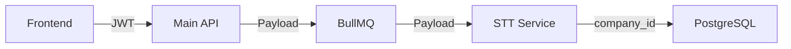

# Request Lifecycle & Context Propagation

## Overview
SalesAI ensures tenant isolation by propagating the `tenant_id` throughout the entire request lifecycle, from the frontend to the backend AI workers.

---

## 1. Request Resolution

### 1.1 Web Application
The frontend resolves the current `tenant_id` from the JWT claims after a user logs in.

- **Mechanism**: The JWT contains `user_id`, `role`, and `company_id`.
- **Request Hook**: Every request from the frontend to `main-api` includes the `Authorization: Bearer <TOKEN>` header.

### 1.2 Sipuni Ingestion
The `sipuni-listener` resolves the `tenant_id` from the API Key or webhook metadata.

- **WebSocket**: The service resolves the `company_id` based on the Sipuni API Key used during the `auth` message.
- **Webhook**: Resolves the `company_id` from the `integration_id` or `api_key` in the request parameters.

---

## 2. Context Propagation

### 2.1 Backend Middleware (Go)
The `main-api` middleware extracts the `tenant_id` (company_id) and injects it into the request context.

```go
func TenantMiddleware(c *fiber.Ctx) error {
    claims := c.Locals("user_id").(map[string]interface{})
    tenantID := claims["company_id"].(string)
    c.Locals("tenant_id", tenantID)
    return c.Next()
}
```

### 2.2 BullMQ Job Context (Redis)
When a job is pushed to BullMQ, the `tenant_id` is included in the JSON payload.

```json
{
  "job_type": "audio_processing",
  "call_id": "880e-4400-...",
  "company_id": "550e-41d4-...",
  "audio_url": "https://..."
}
```

### 2.3 AI Pipeline (Python)
The `stt-service` and `ai-analytics` services extract the `company_id` from the job payload and use it for:
- Fetching tenant-specific AI settings.
- Fetching tenant-specific scripts.
- Filtering database operations.

---

## 3. Data Flow Example



---

## 4. Security Enforcement
- **Validation**: Any request missing a valid `tenant_id` is rejected at the middleware layer.
- **Tenant Mismatch**: Requests attempting to access resources with a `tenant_id` that does not match the JWT claims are denied (403 Forbidden).

---

## Suggested Improvements (Non-Breaking)
- **Correlation ID**: Implement a global `correlation_id` across all services to track a single request (e.g., call ingestion to analysis) through all microservices, tagged with the `tenant_id`.
- **Tenant Context Wrapper**: Use a unified `TenantContext` object in Python to simplify passing the `company_id` through different service layers.
