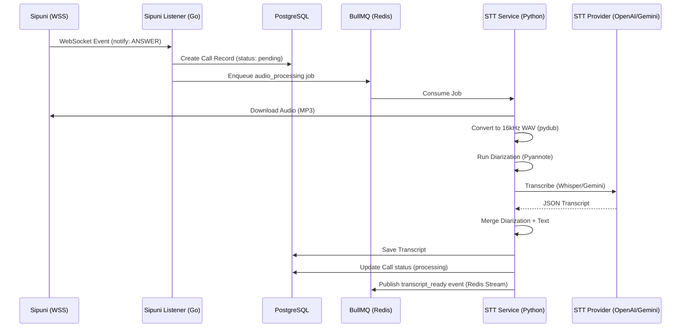

# Ingestion & STT Pipeline Guide

This guide provides a comprehensive overview of the call ingestion and transcription pipeline, focusing on the **Sipuni Listener** and **STT Service**. It is intended for developers who need to maintain or extend these services.

---

## 1. Pipeline Overview

The pipeline starts with an external call event from the Sipuni telephony platform and ends with a speaker-labeled transcript saved in the database, ready for AI analysis.

### 1.1 Sequence Diagram



---

## 2. Sipuni Listener Service

The **Sipuni Listener** is a Go-based service that maintains a persistent connection to the Sipuni WebSocket API.

### 2.1 Core Architecture

- **`cmd/listener/main.go`**: Contains the main execution loop, WebSocket management, and event routing.
- **`internal/adapters/repositories/`**: Handles persistence of new call records.
- **`internal/adapters/queue/`**: Handles publishing jobs to BullMQ.

### 2.2 How to Modify

#### Adding New Event Types
To handle additional Sipuni events (e.g., `HANGUP`, `RINGING`):
1. Locate the `handleNotify` function in `cmd/listener/main.go`.
2. Inspect the `notify.Status` field.
3. Currently, only `ANSWER` status with a `call_record_link` is processed. You can add more conditions or branches to handle other statuses.

#### Changing Metadata Parsing
If Sipuni updates its API or you need to extract more fields:
1. Update the `SipuniNotifyRequest` struct in `cmd/listener/main.go`.
2. Modify the logic in `handleNotify` to map the new fields to the `domain.Call` entity.
3. Ensure the `CallRepository` and database schema are updated if you add new persisted fields.

---

## 3. STT Service

The **STT Service** is a Python-based microservice that processes audio and generates transcripts.

### 3.1 Core Architecture

- **`src/adapters/queue/bullmq_consumer.py`**: Listens for `audio_processing` jobs.
- **`src/core/usecases/process_audio.py`**: Orchestrates the 6-step processing flow (Download -> Convert -> Archive -> Transcribe -> Diarize -> Merge).
- **`src/adapters/stt/`**: Contains specific implementations for different STT providers (OpenAI, Gemini, Groq, Deepgram).

### 3.2 How to Modify

#### Adding a New STT Provider
1. **Create a Provider Class**: Add a new file in `src/adapters/stt/` (e.g., `assemblyai_provider.py`). It should implement the `transcribe(audio_path)` method.
2. **Register the Provider**: In `src/core/usecases/process_audio.py`, update the `__init__` method to recognize the new provider name from the `STT_PROVIDER` environment variable.
3. **Environment Variables**: Add necessary API keys and configuration to `Dockerfile` or `docker-compose.yml`.

#### Modifying Audio Pre-processing
If you need to change the audio quality or format for specific models:
1. Locate the conversion logic in `src/core/usecases/process_audio.py` (Step 2).
2. Adjust `pydub` parameters (e.g., `set_frame_rate(44100)` instead of `16000`).

#### Customizing Diarization
The service uses Pyannote for speaker separation.
1. Modify `src/infrastructure/audio/diarization.py` to adjust the number of speakers or sensitivity.
2. Ensure `merge_transcript_with_diarization` is updated if you change the segment format.

---

## 4. Development & Testing

### 4.1 Local Testing (Sipuni Listener)
Since it depends on a live WebSocket, you can mock Sipuni events by creating a simple WebSocket server that sends `notify` messages to the listener, or by manually inserting records into the database and triggering the STT job.

### 4.2 Local Testing (STT Service)
You can run the STT logic against a local audio file by calling the `ProcessAudioUseCase.execute` method directly in a script:
```python
import asyncio
from src.core.usecases.process_audio import ProcessAudioUseCase

job = {
    "call_id": "test-uuid",
    "audio_url": "https://example.com/test.mp3"
}
asyncio.run(ProcessAudioUseCase().execute(job))
```

Ensure you have a local PostgreSQL and Redis running, or mock the database/queue adapters.
